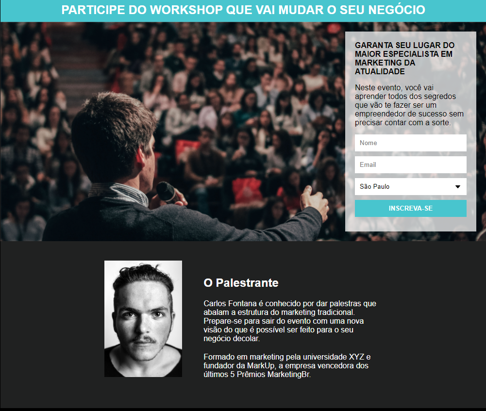

Página Web
  

## :clipboard: Sobre o Projeto

página de captura com objetivo de capturar email e enviar mensagens utilizando integração com mailchimp

## :computer: Tecnologias utilizadas

O projeto foi desenvolvido utilizando as seguintes tecnologias:

- HTML
- CSS

## :closed_book: Licença

Esse projeto está sob a licença MIT. Veja o arquivo [LICENSE](https://github.com/jonathancbrito/pagina-de-captura/blob/main/LICENSE) para mais detalhes.
#
